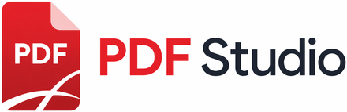

# PDF Studio v4

A modern, feature-rich desktop PDF workbench built with Python + Tkinter.
No cloud, no AI, no subscriptions — ships as a single `.exe`.



## ✨ Features

### UI highlights
- **Smooth animated drag-to-reorder** with eased 60-fps transitions
- **Command palette** (`Ctrl+K`) — fuzzy-search every action
- **Drag-and-drop to open** PDFs (via optional `tkinterdnd2`)
- **Dark & light themes** (`Ctrl+T`), warm cream ↔ deep indigo-black
- **Bookmarks / outline sidebar** (`Ctrl+B`)
- **Grid view toggle** (`Ctrl+G`) — 3-to-8 adaptive columns
- **Keyboard navigation** — ↑↓ Home End PgUp PgDn Space Enter
- **Toast notifications**, **breadcrumb titlebar**, **hover popovers**,
  **undo history dropdown**, **preferences dialog**, **splash screen**

### Acrobat Pro parity
- Open / Merge / Split / Reorder / Rotate / Delete / Reverse
- Insert blank pages, extract included pages
- **Bates numbering** (configurable prefix/suffix/digits/position/scope)
- **Keyword bulk redaction** (regex + case sensitivity)
- **Signature tool** (canvas-draw → stamp on any page)
- **Hyperlink editor** (list / edit / remove)
- **Attachment extractor** (embedded files)
- **TOC auto-generator** (heuristic heading scan)
- **Measuring tool** (pt / in / custom units)
- **Auto-crop** (whitespace detection)
- **Form fields** (fill + flatten AcroForms)
- **Markups** (highlight / underline / strikeout / sticky note)
- **Watermarks**, **Headers/footers**, **Page numbers**, **Stamps**
- **OCR** (pytesseract), **Find & Replace**, **Compare pages**
- **Encrypt / Unlock**, **Compress**, **Metadata editor**, **Linearize**
- **Batch process** whole folders
- **Preset save/load**, **Session persistence**

## 📦 Install / Run (development)

```bash
pip install pypdf pymupdf pillow pdf2image pytesseract tkinterdnd2
python pdf_studio.py
```

## 🔨 Build as `.exe` (Windows)

```cmd
build.bat
```

Produces `dist\PDFStudio.exe` (single-file, ~100 MB, ready to distribute).

See **[BUILD_WINDOWS.md](BUILD_WINDOWS.md)** for details and
troubleshooting.

## 🐧 Build on macOS / Linux

```bash
./build.sh
```

## 🧩 Architecture

```
pdf_studio.py            ← entry + main()
pdf_studio_backend.py    ← PDFStudioBase (business logic)
UI/
  pdf_studio_ui.py       ← PDFStudioUI shell (titlebar, toolbar, rows, …)
  pdf_features.py        ← PDFFeatures mixin (Acrobat-parity dialogs)
  dialog_kit.py          ← Themed primitives + Toast + Splash
  assets/                ← Brand logo (.ico, .png, wordmark)
```

`PDFStudio` class MRO:

```python
class PDFStudio(PDFStudioUI, PDFFeatures, PDFStudioBase):
    pass
```

UI shell → Feature mixin → Business logic. Each layer only knows about
the layers below via method names — no tight coupling.

## ⌨ Keyboard shortcuts

| Key | Action |
| --- | --- |
| `Ctrl+O/S/Z/Y/A` | Open / Save / Undo / Redo / Select all |
| `Ctrl+K` | Command palette |
| `Ctrl+T/B/G` | Theme / Sidebar / Grid view |
| `Ctrl+=/-/0` | Zoom in / out / fit |
| `Ctrl+,` | Preferences |
| `↑ ↓ Home End PgUp PgDn` | Navigate rows |
| `Space` | Toggle include on current page |
| `Enter` | Preview current row |
| `← →` | Previous / next preview |
| `Del` | Delete selected |
| `F1` | Shortcuts help |

## 📁 Project layout

See [README_UI.md](README_UI.md) for the full UX/design writeup.

## 🪪 License

Your call — add a LICENSE file (MIT recommended for desktop tools).
